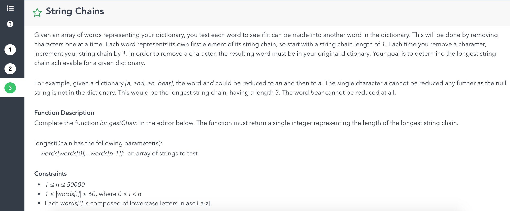

2018/9/01 - 2019/5/27 1-800 
- coding
    - [x] LC easy 268 480
    - [x] LC medium 19 105, 106, 622 647
    - [x] LC hard 44 218
    - [ ] LC Best Time To Buy And Sell Stock I and II, Water trapping + 3D
    - [x] hoffman decoding
    - [ ] 背包问题 输出背包可以装的最大价值 follow up：输出方案
    - [ ] reverse文章，单词不reverse. 要求one pass.
    - [ ] 什么是polymorphism? 有什么用？C++/JAVA是怎么实现的?
    - [ ] 什么是merge sort？实现merge sort
    - [ ] 先問了TCP retry, application一直不ACK怎麼辦 => kernel 先buffer起來，buffer滿了kernel會傳某種（我現在還是不知道）的ACK說buffer滿了
    - [x] implement a mutex/lock
        need hardware provide `test_and_set` function => read the old value and set the value to 1
        ```java
        lock(int R) {
            while (test_and_set(R) == 1);
        }
        unlock(int R) {
            R = 0;
        }
        ```
    - [x] CAP theory
    - [ ] A has an array with N decimal numbers and he want to deliver this message to B. How can A simply send 1 number to achieve the goal?
    - [ ] 如果输入不是sparse number，那么输出下一个sparse number， 如果是就输出当前输入 注：sparse number的定义是，如果一个数的二进制表示有连续的1，那么这个数就不是sparse number，例如：10110就不是sparse， 101010就是
    - [ ] 用给一个有各种括号的字符串，找出有哪些字符串不匹配并且输出这些括号的index
    - [x] 生成随机数1..n，不放回
    - [x] Integer a = new Integer(100), b = new Integer(100); => a == b false
        Integer a = 100, b = new 100; => a == b true
    - [x] 有一个数组 比如[1, 2, 3, 4] 每次可以提取两个数并相加 然后插入到数组尾部, 每一次操作会有一定cost cost等于操作的两个数的和 
        栗子: [1, 2, 3, 4] 取 1，2, 相加得到cost = 3, 然后插入到尾部就是[3, 4, 3]. 经过若干次操作后数组里只会剩一个数了 问总共最小的cost是多少. 
        => use priority queue. and very time poll two smallest elements and insert sum back
    - [x] k-group反转linklist
    - [ ] 转换任意字符串到八位十六进制
    - [ ] C++问题：raw pointer，内存管理，多态和move constructor, sharedptr怎么实现. vector C++咋么实现的，stack咋实现的,queue咋实现的啥时候用，有啥时候queue用vector实现比list快么等等等等。
    - [ ] FTP的细节，TCP为什么可靠，UDP的优点。 TCP/UDP啊，TCP/IP，端口
    - [x] 有一个数组, AB竞赛, A先取数组两端中的一个数，然后B在剩下的数组两端取一个数，然后A取，B取…，直至数组取完，假如A中所有数之和>=B, then A wins.
        => brain teaser
    - [x] find all primes less than n
        ```java
        boolean primes = new boolean[n];
        Arrays.fill(primes, true);
        for (int i = 1; i < n; i++) {
            if (primes[i]) {
                for (int j = i*i; j < n; j++) primes[j] false;
            }
        }
        ``` 
    - [x] 
    - [x] 一个计算量很大要跑很长时间的function，如何设计cache，让其他有same input的function call 不用重复计算，而且在第一个function with input v运算完成时，
        其他有 same input的function就算没有算完也可以立刻得到这个结果。
        ```java
        Map<String, Object> cache; // fun#args hash => result
        Map<String, Set<Thread>> running; // fun#args hash => the threads are performing fun(args) calculation.
        void run() {
            // stage 1
            Object stage1Result = null;
            if (cache.containsKey(hash)) {
                stage1Result = cache.get(hash);
            } else {
                try {
                    running.get(hash).add(Thread.currentThread);
                    stage1Result = calculateStage1();
                    cache.put(hash, stage1Result);
                    running.get(hash).remove(Thread.currentThread);
                    for (Thread t: running.get(hash)) t.interrupt();
                } catch (InterruptedException e) {
                    stage1Result = cache.get(hash);
                }
            }
            // stage 2
            // .....
        }
        ```
- system design
    - [ ] movie tickers app
    - [ ] design twitter 
    - [x] url shorter
    - [ ] 设计交易定价系统
- behavior
    - [ ] why want join citadel
        It is a successful company and it made history. People there are smart and I can learn from them.
    - [ ] why finance, what’s your interest, what’s your goal      
