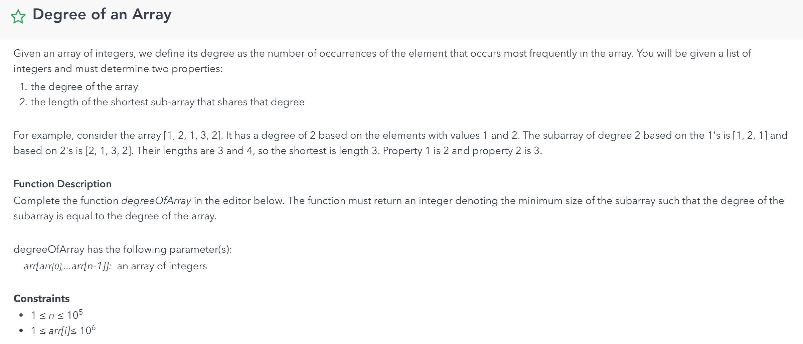
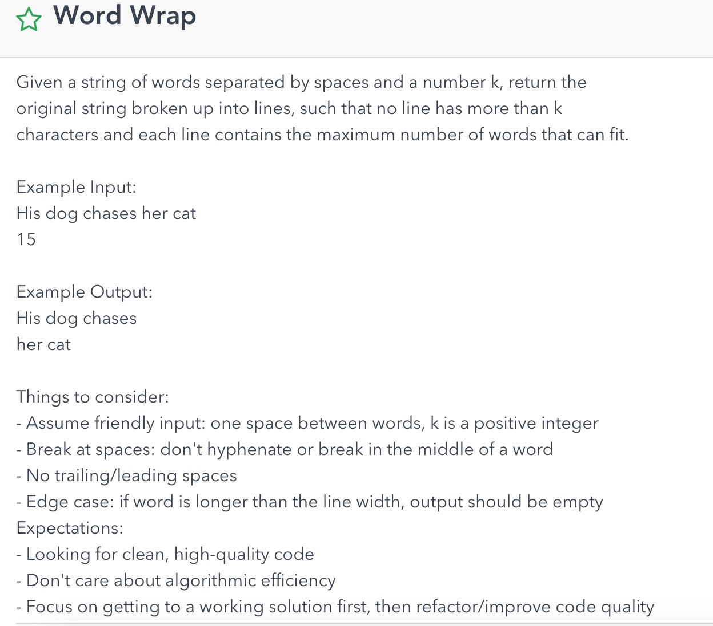
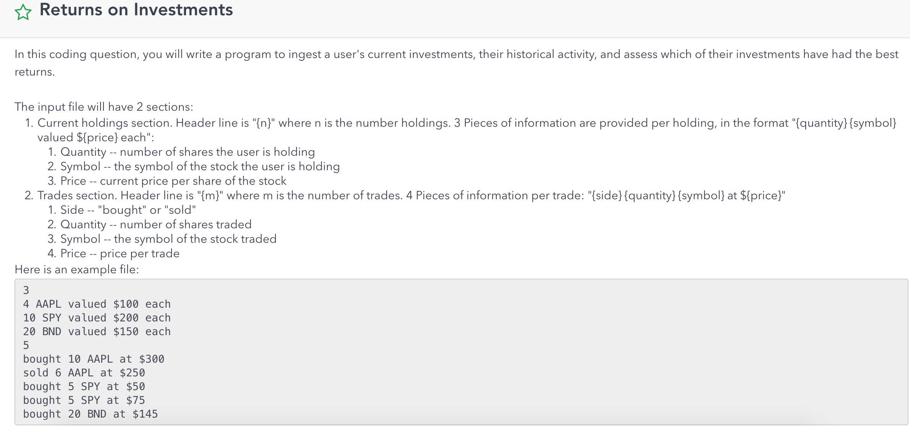
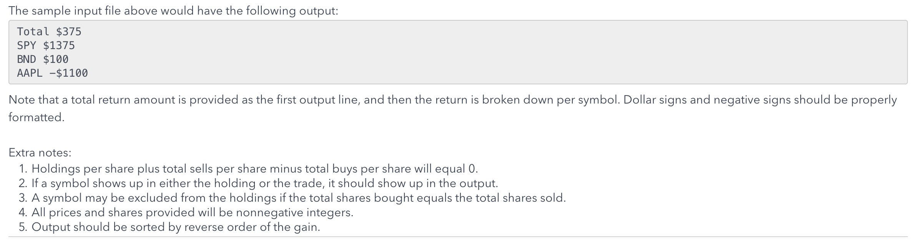

seckcoder
BeAHost2019!
## common 
system design https://www.1point3acres.com/bbs/forum.php?mod=forumdisplay&fid=323&orderby=dateline&orderby=dateline&filter=author&page=1
https://juejin.im/post/5ba63910e51d450e576703a1


## Facebook 
- coding
    - [FB Onsite 2019](https://docs.google.com/spreadsheets/d/1-9Jx6rgUj40xxEtJzRqmGkXoW1QBgsO4CipRMQV2mA8/edit#gid=1531713026)
    - LC 726, 314, 463, 
    - LC 246, 247
    - LC 3, 463
    - LC 158
    - LC 简易版 65（只允许数字 小数点 正负号）
    - 两两交换链表的node
    - For a cycle-linked list, which is sorted, given a node from this list and a target value,
        insert a new node after given node, to make sure the new list is still sorted. example1: 
        -> 1 -> 2 -> 3, given 2 and target value 3, insert 3 after 2, 
        new list is: -> 1 -> 2 -> 3 -> 3
    example2: -> 1 -> 2 -> 3, given 2 and target value 1, new list is: -> 1 -> 1-> 2 -> 3
    https://www.1point3acres.com/bbs/forum.php?mod=viewthread&tid=517238&extra=page%3D24%26filter%3Dauthor%26orderby%3Ddateline%26sortid%3D311%26sortid%3D311%26orderby%3Ddateline
- system design
    - design instagram
    - 设计100K的web服务器到10K(1000qps)搜索服务器的最佳通讯方式，利用load balancer或者message queue来做
    - 设计类似利口的做题网站，每天可以提供若干次竞赛，用户需要注册之后登陆然后提交代码，关键是要快速列出ranking page


## Google
- coding
    - LC 777, 56, 334, 659, 41
    - 移动键盘和求二叉树最大和的层数
    - [x] 给一个字符串比如"a{b,c}{d,e}"，可能的输出有"abd","abe","acd","ace", 写一个function来实现。follow up 1：如果有"{}"嵌套的情况怎么处理，比如{b,d,{e,f}}, follow up 2: 如果括号不是成对出现怎么处理，比如 "a{b, d, {, c}", 结果有"ab","ad","a{","ac"。
    - [x] 给一个只有0和1的matrix, 1代表可以走，0代表blocked, 问从第一行任意位置开始走能不能走到最后一行。follow up 1: output the path, can be any path，follow up 2: 如果现在matrix里都是大于0的integer, 一开始的cost是0，每走到一个cell当前cost就加上那个cell里的数字，问从第一行走到最后一行最小cost。
    - [x] 一个boolean matrix, true代表可以走，false代表blocked，给定start point, end point，求从start到end的任意path
    - [ ] 应该是面经题，包装比较多。谷歌有m个data center, data center按顺序连成一串。每个data center都有n个机器，相邻data center之间的机器都是相连的，一个data center内部机器不会互相连接。现在有一个job需要完成，job从第一个data center开始，一直传递到最后一个data center。给你两个function, getLatencyTime(machine1, machine2) 代表从一个机器传信息到另一个机器需要的时间，getJobTime(machine)代表给定机器处理job需要的时间，问完成job需要最短时间。follow up: 怎么unit test。如果必须花很多时间处理这个job怎么办，好像和原题无关了，我就说了分布式并行处理之类的。LC 743
    - [ ] 建水井。一个村子有很多房子，现在需要建水井让所有的房子都有水用，可以直接在房子上建水井，不同房子建水井有不同开销，也可以在房子之间铺水管对应的也有不同的开销，问怎么弄总开销最小。面完才发现是面经题，所以当时还是面试官一步步引导的。首先问我怎么model这个问题，然后如果只是铺水管怎么总开销最小，最后加上可以在房子上直接建水井的条件。总的来说就是用minimum spanning tree，union find，还跑了些test case。最后我说用一个virtual node连到每家，连接的edge代表在这家建水井的cost，面试官说是每家都弄一个virtual node，就听他的了吧。
    - [ ] 实现一个iterator class, input是正常的iterator, 这个class可以实现hasNext(), next(), skip(element), skip(element)会跳过正常iterator里next occurence of the given element。如果skip call n times, 就跳过下面 n个given element，iterator里的elements可以有重复。Refer LC 284 for peek support.
- system design

## [LinkedIn](linkedin.md)

## Robinhood (2018/9/19 - 2019/5/1)
- coding
    - [x] LC 54, 59, 
    - [ ] LC 140, 418, 224 Basic Calculator 3,
    - [ ] 给一个数组，找这个数组的某个区间使得区间的中位数最大
    - [ ] 写一个function来算input的mean max min等等
    - [ ] 简化版的calculator，只含有括号，加和乘, 类似LC773
        "((1+2)*3)" -> 9
        operators: + *
        operands: 0-9
        Arbitrarily nested parenthesis 

        "((1+2)*((1+((2)))*3))": Valid
        "(((4)))"
        Always balanced

        "(1+2*3)"" -> Not allowed
        "(1+(2*3))" -> 7


        ((1+2)*3)
    - [ ] [bank account transfer problem](http://web.mit.edu/6.005/www/fa15/classes/23-locks/#locking)
        ```python
        def bad_transfer(src_account, dst_account, amount): 
            src_cash = src_account.cash # DB read
            dst_cash = dst_account.cash # DB read
            if src_cash < amount: 
                raise InsufficientFunds
            src_account.cash = src_cash - amount # DB write
            src_account.send_src_transfer_email()
            dst_account.cash = dst_cash + amount # DB write     
         
            dst_account.send_dst_transfer_email()
        ```
    - [x] 
        ```java
        int degreeOfArray(int[] array) {
            Map<Integer, Integer> counts = new HashMap<>();
            Map<Integer, int[]> width = new HashMap<>();
            int maxCount = 0;
            for (int i = 0; i < array.length; i++) {
                counts.put(array[i], counts.getOrDefault(array[i], 0) + 1);
                maxCount = Math.max(maxCount, counts.get(array[i]) + 1);
                if (width.containsKey(array[i])) width.get(array[i])[1] = i;
                else width.put(array[i, new int[]{i, i});
            }
            int minLen = array.length;
            for (int i = 0; i < array.length; i++) {
                if (counts.get(array[i]) == maxCount) {
                    int[] w = width.get(array[i]);
                    minLen = Math.min(minLen, w[1] - w[0]);
                }
            }
            return minLen + 1;
        }
        ```
    - [x] 
        ```java
        List<String> wordWrap(String words, int k) {
            List<String> result = new ArrayList<>();
            String[] ss = words.split(" ");
            int n = ss.length;
            StringBuilder sb = new StringBuilder(); 
            for (int i = 0; i < n; i++) {
                if (ss[i].length() > k) return "";
                if (sb.length() + ss[i].length() > k) {
                    sb.deleteCharAt(sb.length()-1);
                    result.add(sb.toString());
                    sb.setLength(0);
                } 
                sb.append(ss[i]);
                sb.append(' ');
            }
            return result;
        }
        ```
    - [x]  

- System design
    - message app for families。需要考虑产品功能，UI设计，API设计以及后台的Data Model
    - implement Publisher Subscriber
    - robinhood有一个股票价格变动幅度5%就发一个push notification给关注这个股票的用户， 要求设计一个系统完成这个功能
    - 假设exchange有一个异步的API来post market order和查询order状态 要求做一个robinhood的交易功能，要求任何情况都不能挂。这轮被考到了，需要考虑exchange的API timeout和server crash的情况。面试官让你写实现功能的flow然后考虑哪一步会挂。主要是local db会有一个state，exchange那边会有一个state，在上述情况有可能out of sync。思路是先commit local db的transaction再去call exchange API，然后用aync job来verify和fix inconsitency
    - 一个API service的load banlancer后面会有很多个server，每个server都会有一个log，如何将这些log merge起来，并且设置monitor，alert之类的。楼主的答案是基于Kafka的。
    - design一个family messaging app，从database，到API，到front-end
    - 设计股票交易系统


## Jane Street (All time)
- coding
    - [ ] buy and sell stock 
    - [ ] input: char[][] matrix, int i, int j，其中(i, j)相当于matrix上某点，matrix上每char可能是{up, down, right, left, x},其中x有且只有一个 问是否能从（i, j）走到x所在的点. output: boolean

## [Uber](uber.md)


## Microsoft
    - lc 752   
    - lc 361. Bomb Enemy
    - lc 81. Search in Rotated Sorted Array


1. 设计一个洗衣房系统（亚麻）
2. 设计一个停车场推荐系统（根据client所在位置，推荐一个附近的停车场，使得停车场效率比较高） 
3. poll 模式与 push模式的区别？ 我是从 数据一致性、latency、cash命中效率等方面解答的，供参考。 （亚麻）
4. 设计一个比较通用的监控系统    