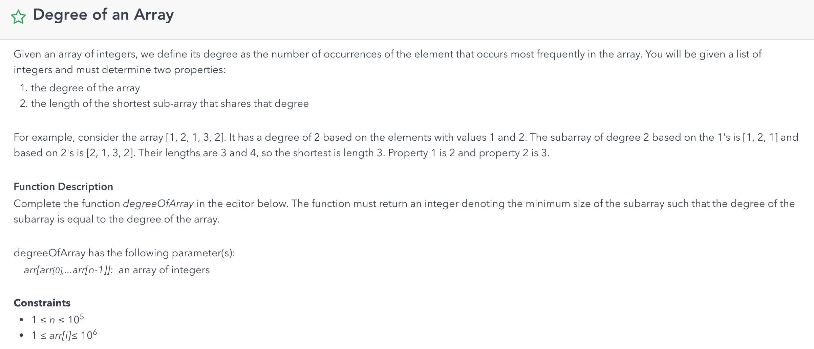
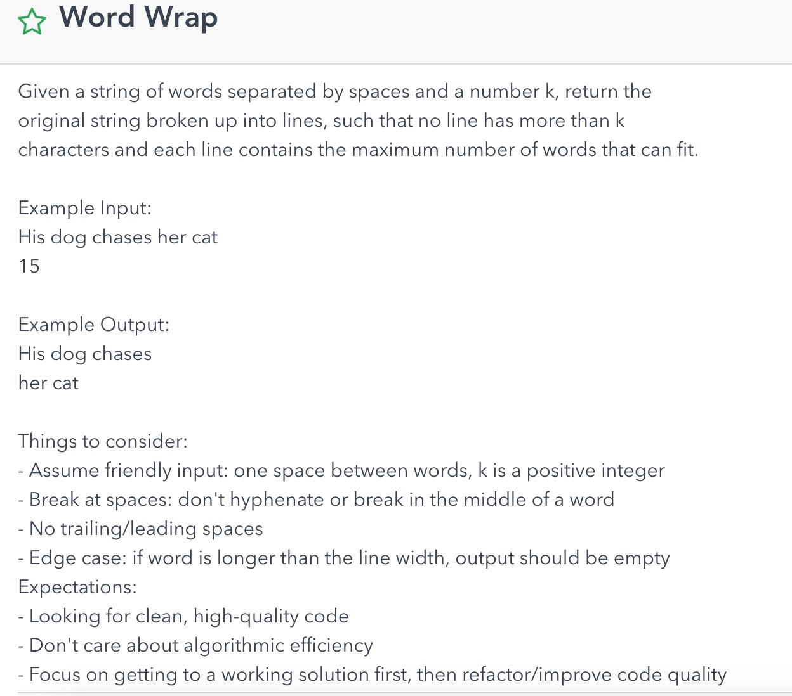
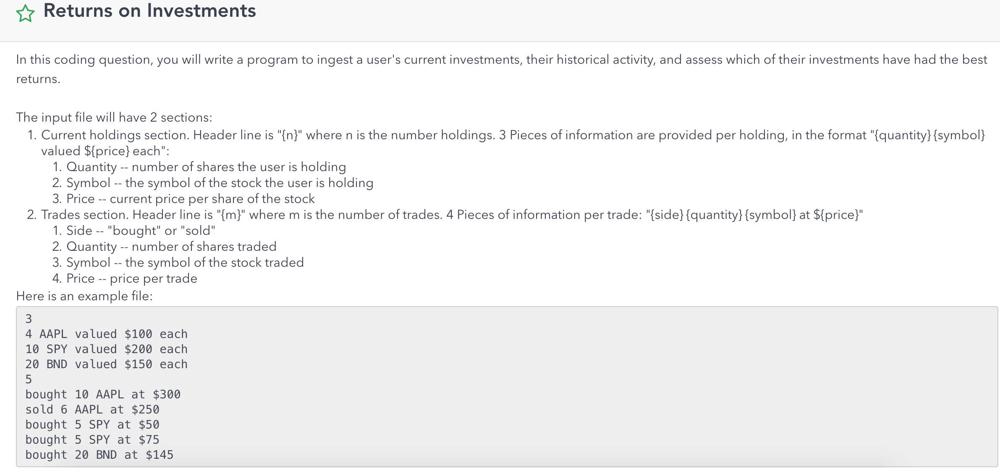
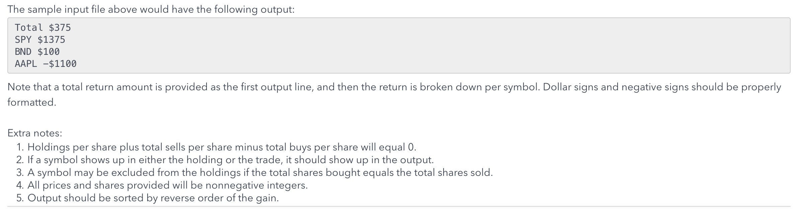

(2018/9/19 - 2019/5/22)
- coding
    - [x] LC 54, 59, 140, 224 418 516
    - [x] 写一个function来算input的mean max min等等
    - [x] [bank account transfer problem](http://web.mit.edu/6.005/www/fa15/classes/23-locks/#locking)  
        java sync pattern
        ```java
        public synchronized void decrement() {} 
        ```
        ```java
        synchronized(this) {
            ....
        }
        ```
        ```java
        Lock lock = new ReentrantLock();
        lock.lock();
        try {
            ...
        } finally {
            lock.unlock();
        }
        ```

        ```python
        def bad_transfer(src_account, dst_account, amount): 
            src_cash = src_account.cash # DB read
            dst_cash = dst_account.cash # DB read
            if src_cash < amount: 
                raise InsufficientFunds
            src_account.cash = src_cash - amount # DB write
            src_account.send_src_transfer_email()
            dst_account.cash = dst_cash + amount # DB write     
         
            dst_account.send_dst_transfer_email()
        ```
    - [x] 
        ```java
        int degreeOfArray(int[] array) {
            Map<Integer, Integer> counts = new HashMap<>();
            Map<Integer, int[]> width = new HashMap<>();
            int maxCount = 0;
            for (int i = 0; i < array.length; i++) {
                counts.put(array[i], counts.getOrDefault(array[i], 0) + 1);
                maxCount = Math.max(maxCount, counts.get(array[i]) + 1);
                if (width.containsKey(array[i])) width.get(array[i])[1] = i;
                else width.put(array[i, new int[]{i, i});
            }
            int minLen = array.length;
            for (int i = 0; i < array.length; i++) {
                if (counts.get(array[i]) == maxCount) {
                    int[] w = width.get(array[i]);
                    minLen = Math.min(minLen, w[1] - w[0]);
                }
            }
            return minLen + 1;
        }
        ```
    - [x] 
        ```java
        List<String> wordWrap(String words, int k) {
            List<String> result = new ArrayList<>();
            String[] ss = words.split(" ");
            int n = ss.length;
            StringBuilder sb = new StringBuilder(); 
            for (int i = 0; i < n; i++) {
                if (ss[i].length() > k) return "";
                if (sb.length() + ss[i].length() > k) {
                    sb.deleteCharAt(sb.length()-1);
                    result.add(sb.toString());
                    sb.setLength(0);
                } 
                sb.append(ss[i]);
                sb.append(' ');
            }
            return result;
        }
        ```
    - [x]  

- System design
    - [x] message app for families。需要考虑产品功能，UI设计，API设计以及后台的Data Model
        - users (id, name)
        - messages (id, family_id, user_id, ts)
        - family_users (id, user_id)
    - implement Publisher Subscriber
    - [x] robinhood有一个股票价格变动幅度5%就发一个push notification给关注这个股票的用户， 要求设计一个系统完成这个功能
        two problems: 1. how to know 5% change. 2. when it happens, whom and how will the message sent to.
        1. We have a table records the closing price or opening price of for each stock.
        2. For any write operation to the storage (sql/redis...), check the percent of change of the day `(updated_price - yesterday_closing_price) / yesterday_closing_price > 5%`
        3. If it is, then from table `user_stocks(user_id, stock)` to find out all interested users and then send push notification
    - [ ] 假设exchange有一个异步的API来post market order和查询order状态 要求做一个robinhood的交易功能，要求任何情况都不能挂。这轮被考到了，需要考虑exchange的API timeout和server crash的情况。
    面试官让你写实现功能的flow然后考虑哪一步会挂。主要是local db会有一个state，exchange那边会有一个state，在上述情况有可能out of sync。思路是先commit local db的transaction再去call exchange API，
    然后用aync job来verify和fix inconsitency
    - [x] 一个API service的load banlancer后面会有很多个server，每个server都会有一个log，如何将这些log merge起来，并且设置monitor，alert之类的。楼主的答案是基于Kafka的。
    - [ ] 设计股票交易系统
    