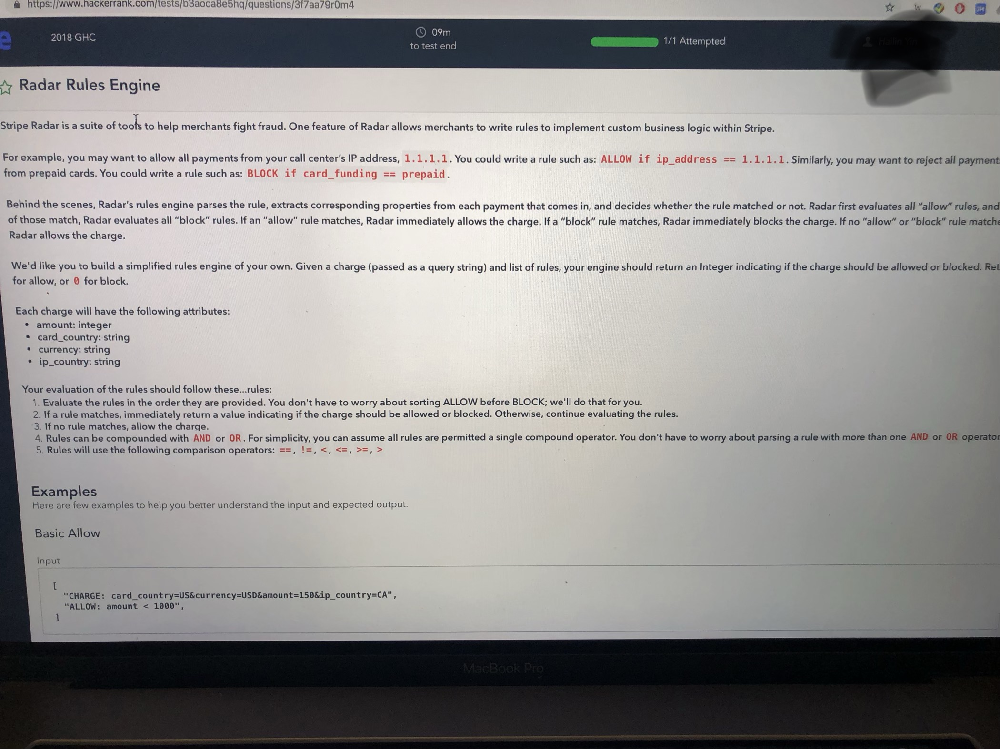

## Strip
2018/8/30 - 2019/6/18
- coding
    - [x] 第一问：一个database，以array of hashmap的形式储存，每一个hashmap是一个record，给你一个key，要你输出database里对应这个key的value最小的record.
            如果一个key不在某一个element里面，则假定值为0. 
        第二问：给一个key，和一个direction("asc", "desc")，如果是asc输出最小的record，desc输出最大的
        第三问：用第二问的function实现第一问
        第四问：写一个comparator来实现第二问
        第五问：给一个sortorder, i.e., a list of (key, direction) pairs， 每一个都是key， direction，就是先根据第一个的key，direction排序，有tie再根据第二个，第三个...
        第六位：用第五问的function来实现第二问
        ```java
        List<Map<String, Integer>> arr;
        Comparator<Map<String, Integer>> comp = Comparator.comparingInt(x -> x.getOrDefault(key, 0));

        Map<String, Integer> result = new HashMap<>();
        result.put("a", Integer.MAX_VALUE);
        for (Map<String, Integer> x : arr) {
            if (comp.compare(x, result) < 0) {
                result = x;
            }
        }
        ```
    - [ ] rate limiter
    - [x] 1 给个数组，查找第一个miss的int，从1开始。
        next_server_number([5, 3, 1])  2
        next_server_number([5, 4, 1, 2])  3
        next_server_number([])  1
        => Set + for loop => O(n)
        在此基础上，实现allocate和deallocate两个函数，给定server_type之后要能返回拼出来的hostname。
        tracker = Tracker.new()
        tracker.allocate("apibox") "apibox1"
        tracker.allocate("apibox") "apibox2"
        tracker.deallocate("apibox1") nil
        tracker.allocate("apibox") "apibox1"
        tracker.allocate("sitebox") "sitebox1"
        => `Map<String, Set<Integer>>`
    - [x] 内容大概就是给一个001010之类的字符串，从左到右扫。
        碰到1会扣分，0不扣分，但一共有一次机会可以选择反面，也就是1不扣分而零扣分。
        例如不使用反面，那就是一共扣 0+0+1+0+1+0=2分。
        例如在"001"的1之前使用反面，那就是一共扣 0+0+0+1+0+1=2分。
        1. 现在给反面的位置，求得分。
        2. 那只给这个字符串，问哪里使用反面扣分最少。=> scan from left, then reverse array, and then scan from right
        3. 那再给一个带+和-的字符串，只有+和-中间的才算，例如+00+00-00-00-，那只有最中间的"+00-"才算。问这些该从哪里使用反面
    - [x] 
    - [x] 实现一个class支持带timestamp的hash table，put的时候需要记录当前的timestamp，del的时候也只是删除了当前的timestamp的值，get的时候返回当前timestamp时候的值
        ```java
        class Ttkv {
            get(key, timestamp)
            put(key)
            del(key)
        }
        ```
    - [x] 给一个json文件，里面包含一些http request和http response，读取之后回放其中的http request，比对http response是否一样。
        => use OkHttp and gson
    - [ ] debugging
- system design
    - [ ] 设计一个event tracking/metrics service 供内部很多其他系统调用，可以用来统计throughput做监控等等。
    - [ ] 设计 webhook. 就是把不同公司的payment route到不同的地方

